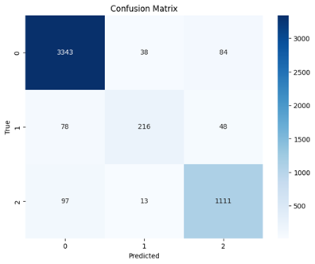
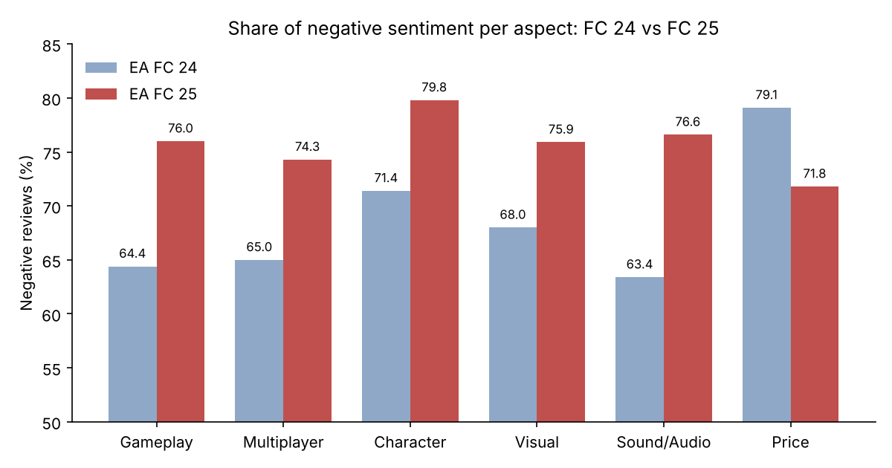

# Sentiment Analysis of EA FC 24 vs EA FC 25 Reviews on Steam

Aspect-based sentiment analysis of Steam user reviews to answer one question: did players feel EA FC 25 improved on EA FC 24? Eight classifiers, from Decision Tree to an LSTM with aspect-based features, were compared on three-class sentiment (negative, neutral, positive).

## Problem

Steam reviews only carry a binary *Recommended / Not Recommended* flag, which says nothing about **what** players liked or disliked. This project:

1. Labels each review's sentiment and tags which game aspects it discusses (gameplay, bugs, price, etc.).
2. Compares sentiment per aspect between EA FC 24 and EA FC 25.
3. Tests how reliable the rule-based VADER labeller is on gaming reviews.
4. Finds the best model for classifying review sentiment.

## Data

- **Source:** user reviews scraped with Selenium from the EA FC 24 and EA FC 25 review pages on the Steam website. No date filter was applied.
- **Fields:** `ReviewText`, `Review` (Recommended / Not Recommended), `ReviewLength`, `PlayHours`, `DatePosted`. No usernames or Steam IDs were collected.
- **Labels:** sentiment from VADER (compound > 0.05 positive, < −0.05 negative, otherwise neutral), then **manually reviewed and corrected**. The corrected labels are the ground truth for modelling.
- **Raw class balance (after correction):**

| Game | Not Recommended | Negative | Neutral | Positive |
|---|---|---|---|---|
| EA FC 24 | 60.3% | 59.0% | 10.5% | 30.6% |
| EA FC 25 | 72.0% | 70.5% | 8.4% | 21.1% |

| File | Contents | Used by |
|---|---|---|
| `data/raw/FC_24.csv`, `data/raw/FC_25.csv` | Scraped reviews (21,890 FC 24 and 3,860 FC 25 rows) | `01_preprocessing` |
| `data/labelled/fc24_vader_raw.csv`, `fc25_vader_raw.csv` | Cleaned text + VADER scores and **uncorrected** VADER label | `01` (before/after comparison) |
| `data/labelled/fc24_labelled.csv`, `fc25_labelled.csv` | Cleaned text + VADER scores + **manually corrected** `Sentiment` label (ground truth) | `01`, `02`, `03` |

## Approach

1. **Scraping:** Selenium scrolls each game's Steam review page and extracts the review fields above.
2. **Preprocessing:** lowercasing; slang/abbreviation expansion (a [Kaggle slang dictionary](https://www.kaggle.com/datasets/aksharagadwe/abbreviations-and-slangs-for-text-preprocessing) plus a manual list); removing URLs, HTML tags, mentions, punctuation and numbers; slang normalisation; tokenisation; lemmatisation.
3. **Sentiment labelling:** VADER, followed by manual correction.
4. **Aspect labelling:** keyword matching against seven hand-built aspect dictionaries (multiplayer experience, character, gameplay, sound/audio, visual, game functionality/bug, price). Reviews matching none are tagged *other*.
5. **Modelling:** six classical models (Decision Tree, Naive Bayes, Logistic Regression, Random Forest, XGBoost, SVM) and two deep learning models (BiLSTM, LSTM+ABSA), evaluated on accuracy, weighted precision/recall and per-class F1.

## Results

### Model comparison (test set, n = 5,028)

| Model | Accuracy | Weighted Precision | Weighted Recall | F1 Negative | F1 Neutral | F1 Positive |
|---|---|---|---|---|---|---|
| Decision Tree | 79.57% | 79.47% | 79.57% | 84.81% | 61.48% | 74.30% |
| Naive Bayes | 74.63% | 69.98% | 74.63% | 83.26% | 0.00% | 61.42% |
| Logistic Regression | 84.59% | 84.40% | 84.59% | 89.18% | 49.12% | 82.90% |
| Random Forest | 84.26% | 84.53% | 84.26% | 88.74% | 67.88% | 78.56% |
| XGBoost | 84.87% | 84.78% | 84.87% | 89.17% | 64.90% | 81.16% |
| SVM | 84.51% | 85.36% | 84.51% | 89.10% | 46.57% | 82.40% |
| BiLSTM | 85.75% | 85.68% | 85.75% | 90.03% | 69.37% | 82.02% |
| **LSTM+ABSA** | **92.88%** | **92.69%** | **92.88%** | **95.75%** | **70.94%** | **90.18%** |

LSTM+ABSA is about 7 points ahead of the next-best model. Every model struggles with the **neutral** class, which is only 342 of 5,028 test reviews; Naive Bayes never predicts it at all.

Neutral recall for LSTM+ABSA is 0.63: most of its errors are neutral reviews pushed into negative or positive.

### FC 24 vs FC 25

- Negative sentiment rose from FC 24 to FC 25 on **every aspect except price** (gameplay 64.4% → 76.0%, character 71.4% → 79.8%, sound 63.4% → 76.6%).
- **Price** is the only aspect that improved (79.1% → 71.8% negative).
- Gameplay and bugs/functionality are the most discussed aspects in both games.

### VADER on gaming reviews

Before manual correction, VADER labelled ~49% of FC 24 reviews as positive; after correction only ~31% were. It misreads sarcasm (*"great waste money"* → positive) and long complaints. Preprocessing made no meaningful difference, and removing capitals and punctuation actually weakens the intensity cues VADER relies on.
*

## How to Run

The notebooks were built in Google Colab. To reproduce the results, start from `01` with the CSVs in `data/raw/`, or jump straight to `02`/`03` with the files in `data/labelled/`. Update the dataset paths in the `read_csv` cells.

Some cleaning and labelling cells in `01` are commented out: they were run once to produce the files in `data/labelled/`, and the notebook then continues from those saved files. The slang dictionary is downloaded with the Kaggle CLI, so you need your own `kaggle.json`.

`00_scraping` needs Selenium and a local Chrome/ChromeDriver, so run it on your own machine rather than Colab. Steam's page layout may have changed since 2024, so the selectors may need updating.

## Limitations & What I Learned

- **Ground truth is semi-automatic.** Labels come from VADER plus manual correction by the team, not independent annotators, so the scores measure agreement with our own labelling.
- **Aspect keywords overlap.** Very common words (`game`, `play`, `player`) sit in the gameplay and character lists, so those aspects catch almost every review; `crowd` appears under both sound and visual. A review can count toward several aspects.
- **Neutral is under-represented** (~7% of the test set), which drags down every model's neutral F1. Class weighting or resampling is the obvious next step.
- **No transformer baseline.** A fine-tuned BERT-family model would be the fair benchmark against LSTM+ABSA and would likely handle sarcasm better than VADER.
- Biggest lesson: a popular lexicon tool like VADER can be badly wrong on domain text. Checking a sample by hand changed the overall sentiment picture completely.

## Course & Contribution

Final project for **Data Mining II**, Semester 5 (2024), Universitas Airlangga. Team of 4.

**My contribution:** built the Steam scraper, the preprocessing pipeline and the classical machine learning notebook (6 models), and co-wrote the report. The BiLSTM and LSTM+ABSA notebook was built by teammates.

**Report:** [docs/report.pdf](docs/paper.pdf) · **Slides:** [docs/presentation.pdf](docs/PPT.pdf)